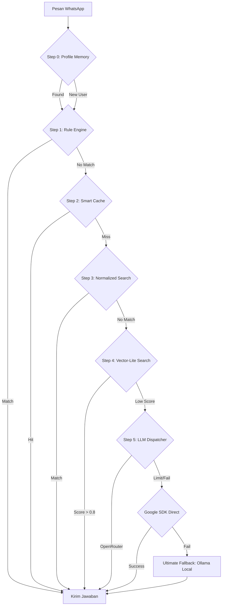

# ImmiCare — Asisten Pintar Paspor Kantor Imigrasi Pangkalpinang 🤖👮‍♂️ Indonesia

**ImmiCare** adalah chatbot WhatsApp pintar yang dirancang khusus untuk membantu warga mendapatkan informasi layanan paspor secara cepat, akurat, dan ramah. 

---

## 🌟 Apa yang Bisa Dilakukan ImmiCare?

Chatbot ini bukan sekadar robot biasa. Dia punya "otak" buatan (AI) yang memungkinkannya untuk:
- 🕒 **Menjawab 24 Jam**: Tidak perlu menunggu jam kerja kantor untuk bertanya syarat paspor.
- 🧠 **Memori Jangka Panjang (Baru!)**: ImmiCare kini bisa mengingat nama dan riwayat percakapan Anda. Jika Anda pernah bertanya tentang paspor hilang, dia akan ingat saat Anda kembali lagi.
- 💡 **Paham Bahasa Santai**: Anda bisa bertanya dengan bahasa sehari-hari, tidak harus kaku.
- 📚 **Selalu Belajar**: Jika ada pertanyaan yang dia tidak tahu, Admin kantor akan memberitahu jawabannya, dan chatbot akan langsung ingat selamanya.
- 🚀 **Sangat Cepat**: Jawaban biasanya dikirim dalam hitungan detik.

---

## 📲 Cara Menggunakan (Untuk Warga)

Cukup kirim pesan WhatsApp ke nomor resmi Kantor Imigrasi PKP. Anda bisa bertanya tentang:
- "Apa syarat bikin paspor baru?"
- "Berapa biaya paspor elektronik?"
- "Jadwal pelayanan hari ini?"
- "Paspor saya hilang, bagaimana solusinya?"

---

## 👮‍♂️ Panduan Untuk Admin (Petugas Imigrasi)

Sangat mudah untuk mengelola chatbot ini tanpa perlu jago komputer:

### 1. Mengisi Data Jawaban
Anda hanya perlu mengisi **Google Sheets** (Excel Online) yang sudah kami siapkan. Chatbot akan otomatis mengambil data dari sana.
- Masukkan pertanyaan di kolom "Pertanyaan".
- Masukkan jawaban di kolom "Jawaban".

### 2. Dashboard Admin & Broadcast (Baru!)
Kami menyediakan halaman web cantik (Dashboard) untuk memantau:
- **Monitor Real-time**: Siapa saja yang sedang bertanya.
- **Broadcast Engine**: Kirim pesan massal ke pemohon yang pernah menghubungi chatbot (misal: info gangguan sistem atau pengumuman penting).
- **Statistik Kesehatan**: Status RAM, Uptime, dan performa AI.

### 3. Perintah Lewat WhatsApp
Admin bisa mengatur robot langsung dari chat WhatsApp dengan perintah simpel:
- `!status` : Cek apakah robot sedang sehat atau butuh istirahat.
- `!audit` : Minta robot menganalisa sendiri jawabannya (untuk memastikan akurasi).
- `!gas` : Langsung kirim jawaban terbaik hasil analisa robot ke pengguna + simpan otomatis.
- `!benar` / `!salah` : Beri tahu robot secara instan jika jawabannya tepat atau perlu diperbaiki.
- `!sync` : Paksa robot mengambil data terbaru dari Google Sheets.
- `!sync-local` : Backup data ke penyimpanan lokal komputer (Offline Security).

### 4. Sistem Guardian Nudge 🛡️
Robot akan otomatis mengirimkan pesan khusus ("Nudge") ke WhatsApp Admin jika dia merasa kurang yakin dengan jawabannya atau jika dia terpaksa menggunakan nalar AI (bukan dari database). Ini membantu Admin memantau kualitas tanpa harus membaca semua chat satu per satu.



---

## 🛠️ Cara Menjalankan Pertama Kali (Sangat Mudah)

1. **Pasang Node.js**: Download dan instal Node.js dari situs resminya.
2. **Download File Ini**: Simpan folder `chatbot_new` di komputer Anda.
3. **Buka Terminal/CMD**: Ketik perintah berikut:
   ```bash
   npm install
   npm start
   ```
4. **Scan QR Code**: Ambil HP kantor, buka WhatsApp > Perangkat Tertaut > Tautkan Perangkat. Scan kode yang muncul di layar komputer. **Selesai!**

---

## 💎 Kenapa ImmiCare Spesial?

Sistem ini dibuat agar **100% Gratis** dan **Tetap Ringan** meskipun dijalankan di komputer kantor biasa (RAM 8GB). Dengan sistem memori baru, pelayanan publik terasa lebih personal dan manusiawi. Robot ini dirancang untuk tidak pernah tidur, menjaga pelayanan publik tetap prima setiap saat.

---

> [!NOTE]
> Jika Anda adalah seorang teknisi atau programmer yang ingin mempelajari "daleman" sistem ini, silakan baca [ReadMeForDevs.md](./ReadMeForDevs.md).

**Versi:** 4.0 — Edisi Long-Term Memory & Broadcast Pro
**Dibuat Oleh:** Tim Inovasi Imigrasi PKP
