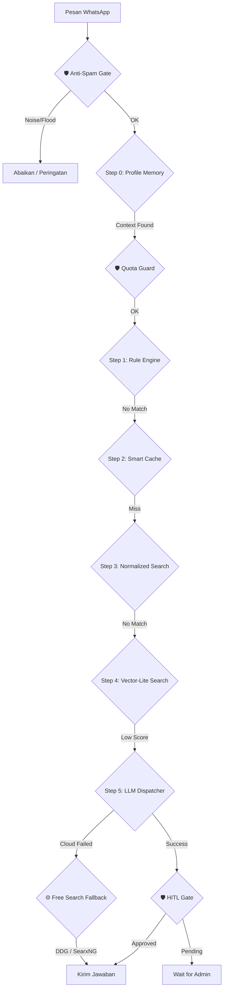

# ImmiCare Technical Reference Guide — Stability & Resilience Architecture (v4.5) 🛠️🤖⚖️

Selamat datang di panduan teknis **ImmiCare**. Dokumen ini berisi detail implementasi infrastruktur, proses manajemen, dan arsitektur AI untuk memastikan bot berjalan 24/7 dengan tingkat kegagalan minimum.

---

## 🏛️ Arsitektur Ketahanan (Process Management)

Sistem ini dirancang untuk "Zero Manual Intervention" menggunakan kombinasi Guardian dan PM2.

### 1. Guardian System (`guardian.js`)
Penyangga utama yang memantau proses `server.js`:
- **Auto-Recovery**: Menghidupkan kembali bot dalam 5 detik jika terjadi crash.
- **Memory Cap**: Membatasi RAM Node.js pada 768MB agar tidak membebani host.
- **Anti-Loop**: Menjeda restart jika terjadi crash 5x berturut-turut dalam 10 menit.

### 2. PM2 Production Management
Bot dikelola secara profesional menggunakan PM2:
- **Service Name**: `immicare`
- **Auto-Startup**: Dikonfigurasi dengan `pm2-windows-startup` agar otomatis menyala saat server/PC reboot.
- **Persistent State**: Status `botPaused` disimpan di `settings.json` sehingga tetap sinkron meskipun bot di-restart.

### 3. Remote Monitoring (PM2 Plus)
Admin dapat mengontrol server dari jarak jauh melalui [app.pm2.io](https://app.pm2.io/):
- **Dashboard Cloud**: Pantau CPU, RAM, dan Log secara real-time dari browser atau aplikasi HP.
- **Remote Action**: Menghidupkan bot yang mati (`!shut`) dari luar kantor.

### 4. AI Brain Anti-Crash & Garbage Collection (Update v4.5)
Ketahanan pada layer kode AI untuk menangani instabilitas server API pihak ketiga:
- **Optional Chaining & Null-Safe Vector**: Mencegah fatal error (TypeError) ketika API AI atau Embedding mengembalikan data kosong (`null`) dengan melakukan pencegatan variabel aman tanpa menghentikan eksekusi sisa dokumen.
- **Memory Garbage Collector**: Loop otomatis setiap jam yang memantau dan menghapus riwayat RAM (`chatHistory`) pengguna dengan waktu diam (idle) > 24 jam untuk mencegah OOM (Out Of Memory).
- **Graceful API Circuit Breaker**: Mekanisme rotasi kunci API dinamis yang menerapkan waktu *cooldown* 3 menit ketika API Google/OpenRouter terkena *Rate Limit*, mencegah pembelokiran IP server akibat penembakan request yang agresif.

---

## 🚀 Alur Kerja Pesan (Tiered Pipeline)

---

## 🧠 Human-in-the-Loop (HITL) Logic
Untuk meminimalisir halusinasi AI pada layanan publik, sistem mengimplementasikan gerbang verifikasi:
- **Trigger**: Pertanyaan kompleks (`isComplex`), jawaban AI baru (`wasAIGenerated`), atau skor keyakinan rendah (`confidence: low`).
- **State Handling**: Pesan ditahan dalam `lastInteractions` dengan status `awaiting_approval`.
- **Admin Alert**: Mengirim draf jawaban ke nomor admin untuk divalidasi.
- **Approval Flow**: Admin menggunakan `!gas` untuk menyetujui draf atau `!salah` untuk melakukan overriding jawaban sebelum sampai ke pengguna.

---

## 📂 Panduan Deployment Cloud (Railway)

Proyek ini dilengkapi dengan `Dockerfile` dan `railway.toml` untuk deployment di Railway.app:
1. **Repository**: Hubungkan GitHub ke Railway.
2. **Environment**: Masukkan isi `.env` ke bagian Variables di Railway.
3. **Volume**: Tambahkan volume pada path `/app/.wwebjs_auth` untuk menyimpan sesi WhatsApp agar tidak perlu scan ulang.
4. **Port**: Gunakan port 3000 untuk mengakses dashboard internal.

---

## 📊 Perintah Admin WhatsApp (Update v4.5)

| Perintah | Shortcut | Fungsi Teknis |
| :--- | :--- | :--- |
| `!status` | `!s` | Menampilkan statistik OS RAM + PM2 Performance (CPU & Health). |
| `!pause` | `!p` | Mengatur `botPaused = true` di `settings.json` (Persisten). |
| `!resume` | `!m` | Mengatur `botPaused = false` di `settings.json`. |
| `!shut` | - | Eksekusi `pm2 stop immicare` untuk mematikan bot total. |
| `!sync` | `!y` | Sinkronisasi penuh Google Sheets -> Neon DB -> Vector. |
| `!audit` | - | Analisa mendalam nalar AI terhadap interaksi terakhir. |
| `!gas` | `!g` | Menyetujui draf jawaban HITL atau saran Audit untuk dikirim ke user. |
| `!benar` | `!b` | Konfirmasi jawaban saat ini sudah benar dan simpan ke DB. |
| `!salah [teks]` | `!x` | Koreksi jawaban terakhir dan simpan ke Knowledge Base. |

---

## 🛠️ Persyaratan Sistem
- **Node.js**: v18.x atau v20.x
- **Infrastruktur**: PC Lokal (Windows/Linux) atau Cloud (Railway/Render).
- **Database**: Neon DB (PostgreSQL + pgvector).

---

## 🔬 Riset Strategis: Framework RAG & Model Terbuka

Berdasarkan analisis efisiensi biaya dan performa, sistem ini dirancang dengan fleksibilitas untuk mengadopsi ekosistem open-source guna mencapai biaya operasional nol (*Zero Cost Operation*):

### 1. Framework RAG Open-Source
Sistem ini kompatibel dengan berbagai framework RAG terkemuka yang tersedia secara gratis di GitHub:
- **Orchestration**: LangChain, AutoGen, CrewAI, LangGraph, Google ADK.
- **RAG Specialization**: LlamaIndex, Haystack, LightRAG, DSPy, LLMWare.
- **Keunggulan**: Pemasangan via `pip`/`npm` tanpa biaya lisensi, kontrol penuh atas alur data.

### 2. Model Bahasa Terbuka (Open Weights)
Untuk menghilangkan ketergantungan pada API berbayar (seperti GPT-4o), sistem mendukung penggunaan model open-source yang dihosting sendiri:
- **Llama 3.3 70B**: Performa setara model proprietary dengan efisiensi biaya 5–10× lebih murah jika dihosting sendiri.
- **Mistral Family**: Lisensi Apache 2.0 yang bebas digunakan tanpa batasan, ideal untuk server lokal.
- **DeepSeek V3 / Gemini 2.0 Flash Lite**: Pilihan model efisien untuk latensi rendah.

### 3. Implementasi Biaya Nol
Dengan mengkombinasikan framework di atas dengan model lokal (melalui Ollama atau vLLM), biaya operasional model bahasa dapat ditekan hingga **Rp 0**, hanya menyisakan biaya listrik/server yang sudah ada.

---

## ⚖️ Hak Cipta & Lisensi
Sistem ini bersifat **Internal Enhancement** untuk Kantor Imigrasi PKP. Penggunaan dan modifikasi kode harus sepengetahuan penanggung jawab teknis.

**Pengembang Utama:** Malik Amrullah  
**Edisi:** Stability & Resilience (v4.5)  
**Status:** ✅ Production Ready
