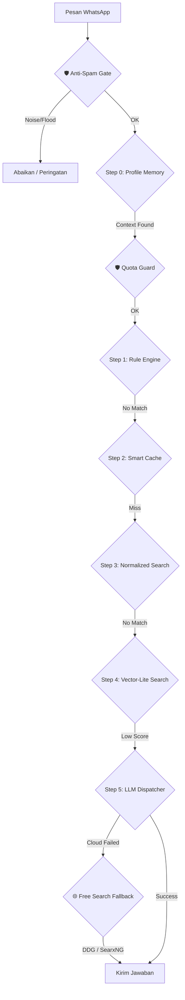

# ImmiCare Technical Reference Guide — Stability & Resilience Architecture (v4.4) 🛠️🤖⚖️

Selamat datang di panduan teknis **ImmiCare**. Dokumen ini berisi detail implementasi infrastruktur, proses manajemen, dan arsitektur AI untuk memastikan bot berjalan 24/7 dengan tingkat kegagalan minimum.

---

## 🏛️ Arsitektur Ketahanan (Process Management)

Sistem ini dirancang untuk "Zero Manual Intervention" menggunakan kombinasi Guardian dan PM2.

### 1. Guardian System (`guardian.js`)
Penyangga utama yang memantau proses `server.js`:
- **Auto-Recovery**: Menghidupkan kembali bot dalam 5 detik jika terjadi crash.
- **Memory Cap**: Membatasi RAM Node.js pada 768MB agar tidak membebani host.
- **Anti-Loop**: Menjeda restart jika terjadi crash 5x berturut-turut dalam 10 menit.

### 2. PM2 Production Management
Bot dikelola secara profesional menggunakan PM2:
- **Service Name**: `immicare`
- **Auto-Startup**: Dikonfigurasi dengan `pm2-windows-startup` agar otomatis menyala saat server/PC reboot.
- **Persistent State**: Status `botPaused` disimpan di `settings.json` sehingga tetap sinkron meskipun bot di-restart.

### 3. Remote Monitoring (PM2 Plus)
Admin dapat mengontrol server dari jarak jauh melalui [app.pm2.io](https://app.pm2.io/):
- **Dashboard Cloud**: Pantau CPU, RAM, dan Log secara real-time dari browser atau aplikasi HP.
- **Remote Action**: Menghidupkan bot yang mati (`!shut`) dari luar kantor.

---

## 🚀 Alur Kerja Pesan (Tiered Pipeline)

---

## 📂 Panduan Deployment Cloud (Railway)

Proyek ini dilengkapi dengan `Dockerfile` dan `railway.toml` untuk deployment di Railway.app:
1. **Repository**: Hubungkan GitHub ke Railway.
2. **Environment**: Masukkan isi `.env` ke bagian Variables di Railway.
3. **Volume**: Tambahkan volume pada path `/app/.wwebjs_auth` untuk menyimpan sesi WhatsApp agar tidak perlu scan ulang.
4. **Port**: Gunakan port 3000 untuk mengakses dashboard internal.

---

## 📊 Perintah Admin WhatsApp (Update v4.4)

| Perintah | Shortcut | Fungsi Teknis |
| :--- | :--- | :--- |
| `!status` | `!s` | Menampilkan statistik OS RAM + PM2 Performance (CPU & Health). |
| `!pause` | `!p` | Mengatur `botPaused = true` di `settings.json` (Persisten). |
| `!resume` | `!m` | Mengatur `botPaused = false` di `settings.json`. |
| `!shut` | - | Eksekusi `pm2 stop immicare` untuk mematikan bot total. |
| `!sync` | `!y` | Sinkronisasi penuh Google Sheets -> Neon DB -> Vector. |
| `!audit` | - | Analisa mendalam nalar AI terhadap interaksi terakhir. |

---

## 🛠️ Persyaratan Sistem
- **Node.js**: v18.x atau v20.x
- **Infrastruktur**: PC Lokal (Windows/Linux) atau Cloud (Railway/Render).
- **Database**: Neon DB (PostgreSQL + pgvector).

---

## ⚖️ Hak Cipta & Lisensi
Sistem ini bersifat **Internal Enhancement** untuk Kantor Imigrasi PKP. Penggunaan dan modifikasi kode harus sepengetahuan penanggung jawab teknis.

**Pengembang Utama:** Malik Amrullah  
**Edisi:** Stability & Resilience (v4.4)  
**Status:** ✅ Production Ready
