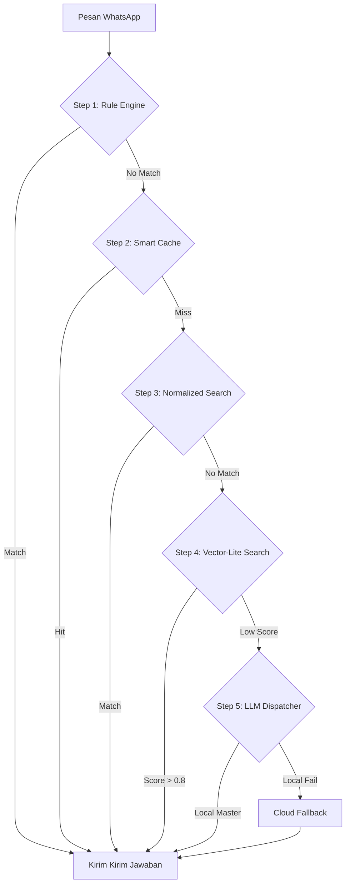

# ImmiCare Technical Reference Guide — Refactored Architecture (v3.5) 🛠️🤖⚖️

Selamat datang di panduan teknis **ImmiCare**. Folder ini berisi kode sumber chatbot WhatsApp berbasis **Resilient AI Dispatcher** yang dirancang untuk berjalan stabil di komputer dengan spesifikasi terbatas (RAM 8GB).

---

## 🏛️ Arsitektur Sistem (Cyber-Resilient & Local-First)

Sistem ini menggunakan arsitektur bertingkat (**Tiered Pipeline**) untuk memastikan kecepatan respon dan efisiensi memori (RAM). 

### Alur Kerja Pesan (5-Step AI Pipeline)



---

## 🚀 Fitur Teknis Utama (Optimasi 8GB RAM)

### 1. 🏠 Local-First & Hybrid Database (`db.js`)
Sistem ini memprioritaskan penyimpanan lokal untuk menjamin **100% Uptime** jika koneksi internet terputus atau Neon DB mengalami gangguan:
- **Neon DB + pgvector**: Sebagai penyimpanan cloud utama.
- **Local Fallback**: Sinkronisasi otomatis ke file JSON lokal (`data/local_kb.json`) setiap kali ada perubahan.
- **sync-local Command**: Admin dapat memicu sinkronisasi manual dari WhatsApp menggunakan perintah `!sync-local`.

### 2. ⚡ Vector-Lite Search (`vectorStore.js`)
Alih-alih mencari di seluruh database yang besar, sistem ini menggunakan strategi **Vector-Lite**:
- **FAQ Subset**: Hanya entri penting dan pendek (FAQ) yang di-filter untuk pencarian semantik cepat di RAM kecil.
- **TopK Tuning**: Pengaturan `config.performance.vectorLiteK` untuk membatasi jumlah hasil pencarian vektor agar hemat memori.

### 3. 🧠 Smart AI Dispatcher (`ai.js`)
- **Reasoning Model**: Menggunakan `phi3:mini` (3.8B) atau `llama3.2:3b` sebagai mesin otak utama di komputer lokal via **Ollama**.
- **Model Switching**: Otomatis beralih ke model yang lebih ringan jika penggunaan RAM sistem terdeteksi kritis (>85%).
- **Circuit Breaker**: Jika kunci API Cloud (Gemini/Mistral/DeepSeek) bermasalah, sistem akan otomatis menjeda (cooldown) kunci tersebut selama 3 menit sebelum dicoba lagi.

### 4. 📂 Modular Express Server
`server.js` telah dimodifikasi menjadi lebih ringkas. Seluruh logika API Admin dipisahkan ke folder `routes/api.js`:
- Pemisahan tanggung jawab (Separation of Concerns).
- Memudahkan debugging pada dashboard admin.
- Integrasi Socket.io untuk notifikasi *real-time*.

---

## 🛠️ Konfigurasi & Setup Developer

### 1. Persyaratan Lingkungan
- **Node.js**: v18.x atau lebih baru.
- **Ollama**: Terinstal dan berjalan di latar belakang (Local AI).
- **RAM**: Minimal 8GB (Direkomendasikan di Windows/Linux).
- **Neon DB**: Database PostgreSQL dengan ekstensi `pgvector`.

### 2. Variabel Lingkungan (.env)
Buat file `.env` dengan isi sebagai berikut:
```env
# AI API Keys
OPENROUTER_API_KEY="sk-or-v1-..."
GEMINI_API_KEY="..."

# Databases
DATABASE_URL="postgresql://..." # Neon DB
GOOGLE_SCRIPT_WEB_APP_URL="..." # Sync Spreadsheet

# Admin Settings
ADMIN_PASSWORD="YourSecretPassword"
PORT=3000
```

### 3. Struktur Folder Utama
- `/routes/api.js`: Logika API Dashboard.
- `/data/`: Penyimpanan JSON lokal (Fallback).
- `config.js`: Pusat pengaturan konfigurasi sistem.
- `ai.js`: Mesin pemrosesan bahasa alami (NLP & LLM).
- `db.js`: Adaptor database (Hybrid Cloud/Local).
- `vectorStore.js`: Operasi pencarian semantik (pgvector).

---

## 📊 Perintah Admin WhatsApp (Teknis)

| Perintah | Deskripsi Teknis |
|---|---|
| `!status` | Laporan RAM, Uptime, Koneksi, dan Statistik Antrean. |
| `!sync-local` | Paksa pembaruan cache JSON lokal dari Cloud DB. |
| `!reindex` | Rekulasi ulang seluruh embedding vektor (Padat & Akurat). |
| `!pause` / `!resume` | Jeda atau aktifkan kembali loop penangan pesan WhatsApp. |
| `!reboot` | Restart proses Node.js (Aman, via Guardian Watchdog). |

---

## ⚖️ Lisensi & Kontribusi
Sistem ini bersifat **Open Enhancement** untuk internal Kantor Imigrasi PKP. Pengembang dapat melakukan modifikasi pada `config.js` untuk menyesuaikan ambang batas (*threshold*) akurasi AI.

**Penyusun:** Antigravity AI Team
**Status:** ✅ Stable for Producion (Local-First Refactored)
