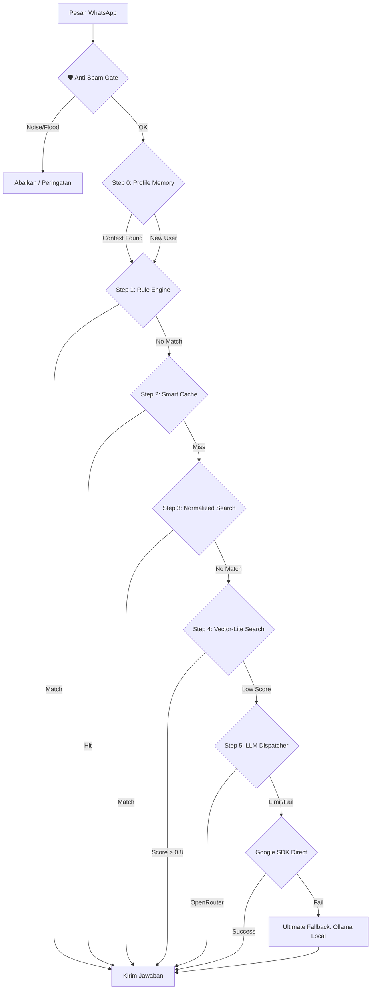

# ImmiCare Technical Reference Guide — Advanced Memory & Anti-Spam Architecture (v4.1) 🛠️🤖⚖️

Selamat datang di panduan teknis **ImmiCare**. Folder ini berisi kode sumber chatbot WhatsApp berbasis **Resilient AI Dispatcher** yang dirancang untuk berjalan stabil di komputer dengan spesifikasi terbatas (RAM 8GB).

---

## 🏛️ Arsitektur Sistem (Cyber-Resilient & Local-First)

Sistem ini menggunakan arsitektur bertingkat (**Tiered Pipeline**) untuk memastikan kecepatan respon dan efisiensi memori (RAM).

### Alur Kerja Pesan (Advanced 6-Step Pipeline + Anti-Spam Gate)



---

## 🚀 Fitur Teknis Utama

### 1. 🛡️ Anti-Spam Rate Limiter (`server.js`)
Sistem perlindungan berlapis untuk mencegah penyalahgunaan dan menjaga stabilitas:
- **Layer 1 (Noise Filter)**: Pesan ≤ 2 karakter yang tidak bermakna (bukan `hi`, `ya`, dsb.) diabaikan secara diam-diam.
- **Layer 2 (Silence Period)**: Setelah peringatan flood, pengguna diblokir selama **30 detik**.
- **Layer 3 (Flood Detection)**: Lebih dari **5 pesan dalam 10 detik** memicu peringatan dan periode diam.
- **Layer 4 (Reply Cooldown)**: Minimal **1.5 detik** jeda antar balasan bot untuk mencegah duplikasi.
- **Auto-Cleanup**: State rate limiter dibersihkan otomatis setiap 10 menit untuk menjaga RAM.
- **Admin Bypass**: Semua filter dilewati untuk nomor admin.

### 2. 🏠 Local-First & Hybrid Database (`db.js`)
Sistem ini memprioritaskan penyimpanan lokal untuk menjamin **100% Uptime** jika koneksi internet terputus atau Neon DB mengalami gangguan:
- **Neon DB + pgvector**: Sebagai penyimpanan cloud utama.
- **Local Fallback**: Sinkronisasi otomatis ke file JSON lokal (`data/local_kb.json`) setiap kali ada perubahan.
- **`!sync-local` Command**: Admin dapat memicu sinkronisasi manual dari WhatsApp.

### 3. ⚡ Vector-Lite Search (`vectorStore.js`)
Alih-alih mencari di seluruh database yang besar, sistem ini menggunakan strategi **Vector-Lite**:
- **FAQ Subset**: Hanya entri penting dan pendek (FAQ) yang di-filter untuk pencarian semantik cepat di RAM kecil.
- **TopK Tuning**: Pengaturan `config.performance.vectorLiteK` (default: 3) untuk membatasi jumlah hasil pencarian vektor agar hemat memori.

### 4. 🧠 Smart AI Dispatcher (`ai.js`)
- **Reasoning Model**: Menggunakan `phi3:mini` (3.8B) sebagai mesin otak utama di komputer lokal via **Ollama**.
- **Model Switching**: Otomatis beralih ke model yang lebih ringan jika penggunaan RAM sistem terdeteksi kritis (>96%).
- **Circuit Breaker**: Jika kunci API Cloud (Gemini/OpenRouter) bermasalah, sistem akan otomatis menjeda (cooldown) kunci tersebut sebelum dicoba lagi.
- **Community AI Fallback**: Fallback ke layanan AI komunitas gratis (Pollinations, G4F) sebelum Ollama lokal.

### 5. 🧠 Long-Term Memory System (`db.js` & `ai.js`)
Sistem dilengkapi dengan profil pengguna (*User Profiling*):
- **Automated Summary**: AI secara otomatis meringkas riwayat percakapan untuk menghemat token konteks.
- **Topical Memory**: Bot mengingat topik terakhir yang dibahas untuk memberikan respon yang nyambung pada sesi berikutnya.
- **Local Fallback**: Profil disimpan di `data/user_profiles.json` jika database cloud offline.

### 6. 📚 PDF Knowledge Base (`pdfReader.js` & `vectorStore.js`)
- Letakkan dokumen PDF di folder `knowledge_pdf/`.
- Gunakan perintah `!sync-pdf` dari WhatsApp untuk menganalisa dan mengindeks isi dokumen secara otomatis.

### 7. 📂 Broadcast Engine & Modular Express
`server.js` mengintegrasikan `Broadcast API` yang memungkinkan Admin mengirim pesan massal dengan jeda keamanan (*anti-ban delay* 3-5 detik):
- **Recipients Discovery**: Ekstraksi otomatis nomor telepon dari log aktivitas.
- **Socket.io Integration**: Notifikasi real-time untuk dashboard admin.
- **Separation of Concerns**: Seluruh logika API dipisahkan ke `routes/api.js`.

### 8. 🌐 SaaS / External API Endpoint
Bot kini dapat diintegrasikan dengan platform eksternal (Botpress, Typebot, website, dsb.) via REST API:
- **Endpoint**: `POST /api/external/chat`
- **Header**: `x-api-key: <EXTERNAL_API_KEY>`
- **Body**: `{ "message": "...", "remoteId": "user_id_opsional" }`
- **Response**: `{ success, answer, metadata: { confidence, wasAIGenerated, source } }`

### 9. 💰 Auto Balance Monitor
Setiap **30 pesan** yang diproses, sistem secara otomatis memeriksa saldo OpenRouter dan mengirimkan peringatan ke WhatsApp Admin jika saldo di bawah **$0.50**.

---

## 🛠️ Konfigurasi & Setup Developer

### 1. Persyaratan Lingkungan
- **Node.js**: v18.x atau lebih baru.
- **Ollama**: Terinstal dan berjalan di latar belakang (Local AI) — opsional.
- **RAM**: Minimal 8GB (Direkomendasikan di Windows/Linux).
- **Neon DB**: Database PostgreSQL dengan ekstensi `pgvector`.

### 2. Variabel Lingkungan (.env)
Salin `.env.example` menjadi `.env` dan isi dengan nilai Anda:
```env
# AI API Keys (Semua opsional, tapi minimal salah satu harus diisi)
OPENROUTER_API_KEY="sk-or-v1-..."
GEMINI_API_KEY="..."
DEEPSEEK_API_KEY="..."
MISTRAL_API_KEY="..."

# Database
DATABASE_URL="postgresql://..."         # Neon DB dengan pgvector

# Google Integration
GOOGLE_SCRIPT_WEB_APP_URL="..."         # Google Apps Script untuk Sheets
GOOGLE_APPLICATION_CREDENTIALS_JSON='{"type":"service_account",...}' # Untuk GA4

# Google Analytics 4
GA4_MEASUREMENT_ID="G-XXXXXXXXXX"
GA4_API_SECRET="..."
GA4_PROPERTY_ID="..."

# Security
ADMIN_PASSWORD="YourSecretPassword"     # Password dashboard web
ADMIN_PHONE="628xxxxxxxxxx"             # Nomor admin (tanpa +, tanpa @c.us)
EXTERNAL_API_KEY="imigrasi_key"         # Kunci untuk endpoint /api/external/chat

# Konfigurasi Bot (Opsional)
PORT=3000
BOT_MODE="balanced"                     # lite | balanced | cloud-backup
VECTOR_MODE="lite"                      # lite | full | off
```

### 3. Menjalankan Bot
```bash
# Install dependensi
npm install

# Jalankan bot (direkomendasikan)
npm run bot          # node --max-old-space-size=768 server.js

# Jalankan dengan Guardian (auto-restart jika crash)
npm start            # node guardian.js
```

### 4. Struktur Folder Utama
| File / Folder | Deskripsi |
|---|---|
| `server.js` | Titik masuk utama: WhatsApp client, admin commands, anti-spam, Express server. |
| `ai.js` | Mesin NLP & LLM Dispatcher (6-step pipeline + circuit breaker). |
| `db.js` | Adaptor database hybrid (Neon Cloud + Local JSON fallback). |
| `vectorStore.js` | Operasi pencarian semantik (pgvector + Vector-Lite). |
| `sheets.js` | Integrasi Google Sheets (baca & tulis knowledge base). |
| `analytics.js` | Pelaporan Google Analytics 4 & category suggestion. |
| `guardian.js` | Watchdog proses untuk auto-restart jika bot crash. |
| `pdfReader.js` | Parser PDF untuk knowledge base dokumen. |
| `config.js` | Pusat pengaturan konfigurasi sistem. |
| `routes/api.js` | Logika API Dashboard (REST endpoints). |
| `public/` | File statis dashboard admin (HTML/CSS/JS). |
| `data/` | Penyimpanan JSON lokal (KB fallback, user profiles, cache). |
| `knowledge_pdf/` | Letakkan dokumen PDF di sini untuk dianalisa bot. |

---

## 📊 Perintah Admin WhatsApp (Teknis)

| Perintah | Deskripsi Teknis |
|---|---|
| `!help` | Tampilkan daftar semua perintah admin yang tersedia. |
| `!status` | Laporan RAM, Uptime, mode bot, jumlah KB, dan status pause. |
| `!saldo` | Cek sisa saldo API OpenRouter secara real-time. Alert jika < $0.50. |
| `!audit` | Deep-analysis interaksi terakhir dengan model reasoning (Self-Correction). Menyimpan rekomendasi untuk `!gas`. |
| `!gas` | Mengirim suggested answer ke user + update Sheets, Neon DB & Vector Store dengan Auto-Category + Zapier webhook. |
| `!benar` | Simpan interaksi ke database sebagai validasi manual (Admin Confirmed). |
| `!salah [Jawaban]` | Koreksi jawaban terakhir & update Sheets, Neon DB, dan cache secara instan. |
| `!sync` | Sinkronisasi penuh: Google Sheets → Neon DB → Vector Store + PDF refresh. |
| `!sync-local` | Backup seluruh Knowledge Base ke file `data/local_kb.json` (Offline Security). |
| `!sync-pdf` | Parse & indeks ulang dokumen PDF dari folder `knowledge_pdf/`. |
| `!pause` / `!resume` | Jeda atau aktifkan kembali loop penangan pesan WhatsApp. |

---

## 🔌 REST API Endpoints (Dashboard)

| Method | Endpoint | Deskripsi |
|---|---|---|
| `GET` | `/api/status` | Status bot, RAM, uptime, AI mode. |
| `GET` | `/api/system/health` | Health check mendalam termasuk info CPU & hardware. |
| `GET` | `/api/kb` | Ambil seluruh knowledge base dari Neon DB. |
| `GET` | `/api/logs?range=24h\|7d\|all` | Ambil log percakapan terfilter. |
| `POST` | `/api/approve` | Tambah entri baru ke knowledge base. |
| `GET` | `/api/backlog` | Daftar pertanyaan yang belum terjawab. |
| `POST` | `/api/backlog/resolve` | Tandai backlog sebagai selesai. |
| `GET` | `/api/recipients` | Daftar nomor yang pernah menghubungi bot (dari log). |
| `POST` | `/api/broadcast` | Kirim pesan massal ke daftar penerima. |
| `POST` | `/api/sync` | Trigger sinkronisasi Sheets → DB → Vector. |
| `POST` | `/api/system/restart` | Restart proses Node.js. |
| `POST` | `/api/system/maintenance/clean` | Bersihkan cache AI. |
| `POST` | `/api/external/chat` | SaaS endpoint untuk integrasi pihak ketiga (butuh `x-api-key`). |

---

## ⚖️ Lisensi & Kontribusi
Sistem ini bersifat **Open Enhancement** untuk internal Kantor Imigrasi PKP. Pengembang dapat melakukan modifikasi pada `config.js` untuk menyesuaikan ambang batas (*threshold*) akurasi AI dan mode operasional.

**Penyusun:** Antigravity AI Team  
**Status:** ✅ Stable for Production (v4.1 - Anti-Spam, SaaS API & PDF Knowledge Edition)
